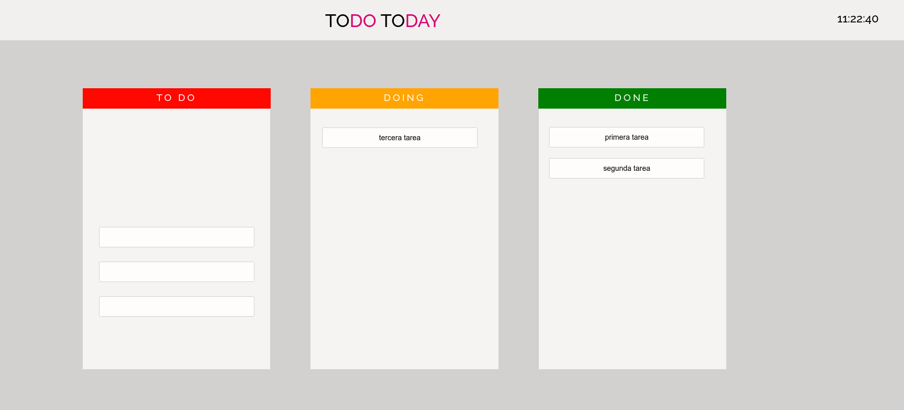

# ToDo Today

ToDo ToDay is a 3-column SCRUM-based planner for your daily tasks.

Tasks can be created, edited and deleted. They change status via a drag and drop functionality.

The web app also included a clock in the upper right corner.
## Technologies

* HTML
* CSS
* JavaScript
* jQuery
# Next

* Create new task functionality on ToDo box
* Delete task functionality
* Make drag and drop user-friendly
* Color based system for priority
* Timer/alarm